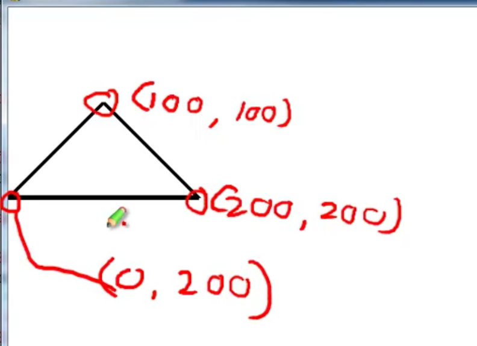

# Python_Colour_Tools
A python tool to help identify colours for colourblind people.

~~1. Take any picture.~~

~~2. Import picture into Python using Skimage.~~

~~3. Select the boxes of colour in which we want to average.~~

Our co-ordinates are read 'inverted' to how you would usually expect them. 
In other words, (0, 0) is the top left corner of our image. (100, 100) is the bottom right corner.

~~4. Auto White Balance from a known area of grey or white.~~

5. Display average colour on screen, ~~with name of colour underneath.~~

Todo:
- Add an error mechanism to prevent unreachable coordinates being read.

